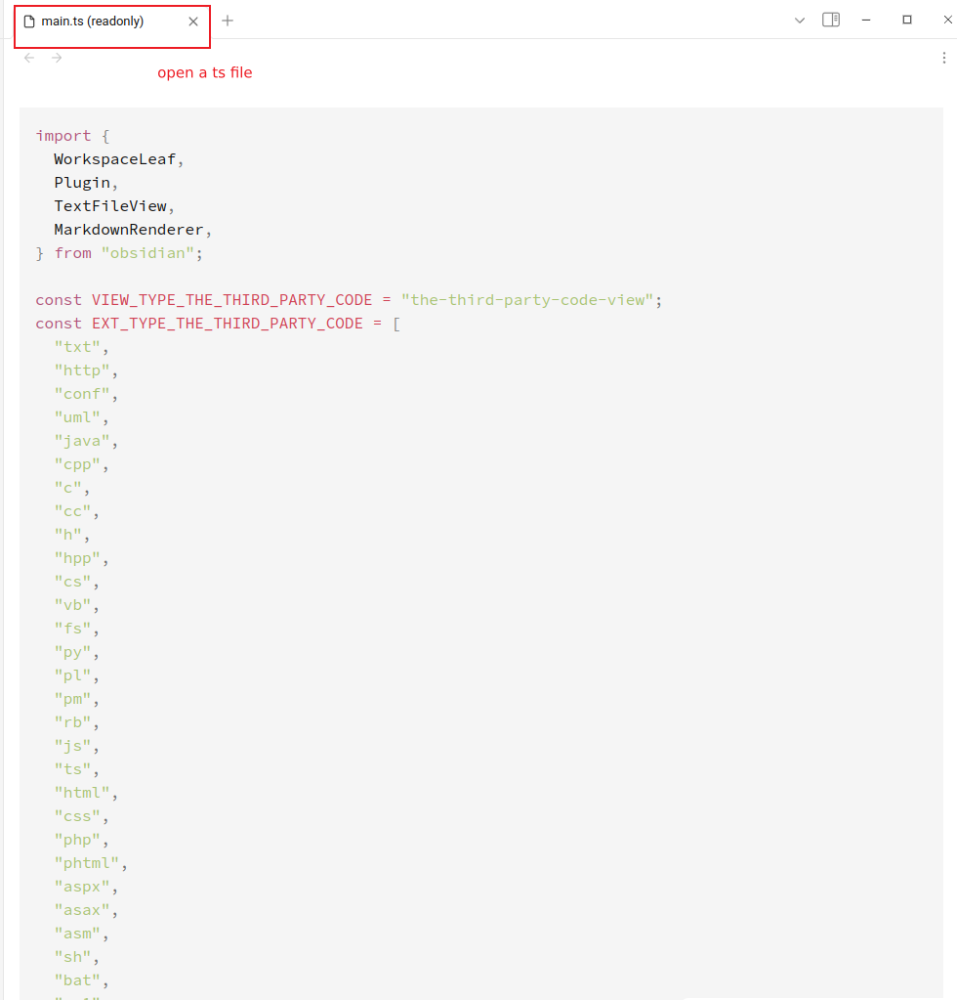

# obsidian-thethirdpartycodeview-plugin

readonly view for the third party code, e.g. java/py/txt...

## supported ext

`txt | http | conf | uml | java | cpp | c | cc | h | hpp | cs | vb | fs | py | pl | pm | rb | js | ts | html | css | php | phtml | aspx | asax | asm | sh | bat | ps1 | sql | xml | json | yml | yaml | toml | ini | properties | go | scala | kt | dart | swift | objc | javafx | lua | r | rs | erl | ex | clj | cljs | jl | sass | less | styl | pug | ejs | mustache | handlebars | hbs | twig | coffee | elm | nim | groovy | vbscript | vbs | awk | tex | hx | ml | re | ml | m | idr | lidr | v | sv | tcl | liquid`

##

